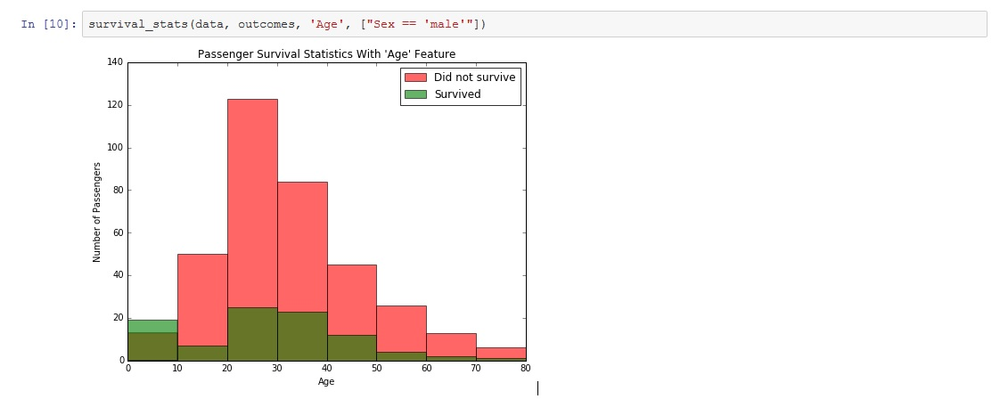
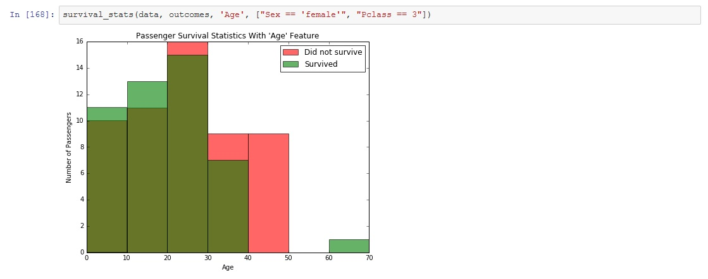

# Titanic_Survival_Exploration
This repository contains project files for ‘Project 0 - Titanic Survival Exploration’ as part of Udacity's Machine Learning Nanodegree. 

In this project, I create decision functions that attempt to predict the survival outcomes from the 1912 Titanic disaster. Passenger features such as sex and age are used in the prediction model. The survival of passengers is predicted with an accuracy of over 80%.

The project can be viewed using the .html file in a web browser, or interactively opening the .ipynb in a Jupyter Notebook.

Starter files provided by Udacity are in the 'titanic_survival_exploration' folder. 

## Screenshots
Below are a couple screenshots showing the distribution of survivors based on age.

## Installation
The installation documentation for the Jupyter platform can be found [here](https://jupyter.readthedocs.io/en/latest/install.html).
The documentation for advanced usage of Jupyter notebook can be found
[here](https://jupyter-notebook.readthedocs.io/en/latest/).

This project requires **Python 2.7** and the following Python libraries installed:

- [NumPy](http://www.numpy.org/)
- [Pandas](http://pandas.pydata.org)
- [matplotlib](http://matplotlib.org/)
- [scikit-learn](http://scikit-learn.org/stable/)

## Usage - Running Jupyter notebook

### Running in a local installation

Launch with:

    $ jupyter notebook
